# 🏗️ BIOMEDICAL PLATFORM ARCHITECTURE

## System Architecture Overview

## Data Flow Architecture

### 1. AI Diagnostics Flow

### 2. Medical Imaging Flow

### 3. Biosensing Data Flow

### 4. HIPAA Audit Flow

## Component Architecture

### AI Diagnostics Service

### Medical Imaging AI Service

## Database Schema (Simplified)

## Security Architecture

## Deployment Architecture (AWS EKS)

```mermaid
graph TB
    subgraph "AWS Cloud"
        subgraph "Public Subnets"
            ALB[Application Load Balancer]
            NAT[NAT Gateway]
        end

        subgraph "Private Subnets - EKS"
            subgraph "Kubernetes Cluster"
                POD1[AI Diagnostics Pods]
                POD2[Medical Imaging Pods]
                POD3[Biosensing Pods]
                POD4[HIPAA Compliance Pods]
                POD5[BioTensor Labs Pods]
                POD6[MYNX NatalCare Pods]
                HPA[Horizontal Pod Autoscaler]
            end
        end

        subgraph "Data Layer"
            RDS[(RDS PostgreSQL<br/>Multi-AZ)]
            ELASTICACHE[(ElastiCache Redis<br/>Multi-AZ)]
            S3[(S3 Buckets<br/>Encrypted)]
        end

        subgraph "Security"
            KMS[AWS KMS]
            IAM[IAM Roles]
            SG[Security Groups]
        end

        subgraph "Monitoring"
            CW[CloudWatch]
            XRAY[X-Ray]
        end
    end

    ALB --> POD1
    ALB --> POD2
    ALB --> POD3
    ALB --> POD4
    ALB --> POD5
    ALB --> POD6

    HPA -.-> POD1
    HPA -.-> POD2
    HPA -.-> POD3
    HPA -.-> POD4
    HPA -.-> POD5
    HPA -.-> POD6

    POD1 --> RDS
    POD2 --> RDS
    POD3 --> RDS
    POD4 --> RDS
    POD5 --> RDS
    POD6 --> RDS

    POD1 --> ELASTICACHE
    POD2 --> ELASTICACHE
    POD3 --> ELASTICACHE
    POD4 --> ELASTICACHE
    POD5 --> ELASTICACHE
    POD6 --> ELASTICACHE

    POD1 --> S3
    POD2 --> S3
    POD3 --> S3
    POD4 --> S3
    POD5 --> S3
    POD6 --> S3

    RDS -.-> KMS
    S3 -.-> KMS
    POD1 -.-> IAM
    POD2 -.-> IAM
    POD3 -.-> IAM
    POD4 -.-> IAM
    POD5 -.-> IAM
    POD6 -.-> IAM

    POD1 -.-> CW
    POD2 -.-> CW
    POD3 -.-> CW
    POD4 -.-> CW
    POD5 -.-> CW
    POD6 -.-> CW
```

## ML Model Pipeline

## CI/CD Pipeline

## Scalability Strategy

## Disaster Recovery

## Technology Stack Summary

| Layer | Technology | Purpose |
|-------|-----------|---------|
| **Frontend** | Next.js 14, React 18, TypeScript | Web applications |
| | React Native | Mobile applications |
| | Tailwind CSS | Styling |
| | CornerstoneJS | DICOM viewer |
| **Backend** | Node.js 18+, Express.js | Microservices |
| | Python 3.11+, FastAPI | ML services |
| | TypeScript | Type safety |
| **Database** | PostgreSQL 15 | Relational data |
| | TimescaleDB | Time-series data |
| | Redis | Caching & sessions |
| **ML/AI** | TensorFlow, PyTorch | Deep learning |
| | scikit-learn, XGBoost | Classical ML |
| | KServe | Model serving |
| **Storage** | AWS S3 | Object storage |
| | AWS EBS | Block storage |
| **Messaging** | Apache Kafka | Event streaming |
| | AWS IoT Core | Device messaging |
| **Security** | AWS KMS | Key management |
| | OAuth 2.0, JWT | Authentication |
| | TLS 1.3 | Encryption |
| **Infrastructure** | AWS EKS | Kubernetes |
| | Terraform | IaC |
| | Docker | Containerization |
| **Monitoring** | Prometheus | Metrics |
| | Grafana | Dashboards |
| | CloudWatch | AWS monitoring |
| **CI/CD** | GitHub Actions | Pipelines |
| | AWS CodePipeline | Deployment |

---

**This architecture is designed for:**
- ✅ 99.9% uptime
- ✅ Horizontal scalability to millions of users
- ✅ HIPAA compliance
- ✅ FDA approval readiness
- ✅ Global deployment
- ✅ Disaster recovery (RPO: 1 hour, RTO: 4 hours)

**Next: Implement each microservice following this architecture!** 🚀
